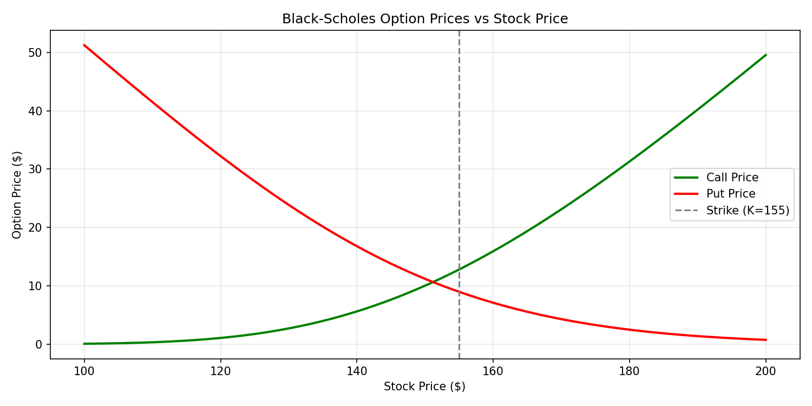
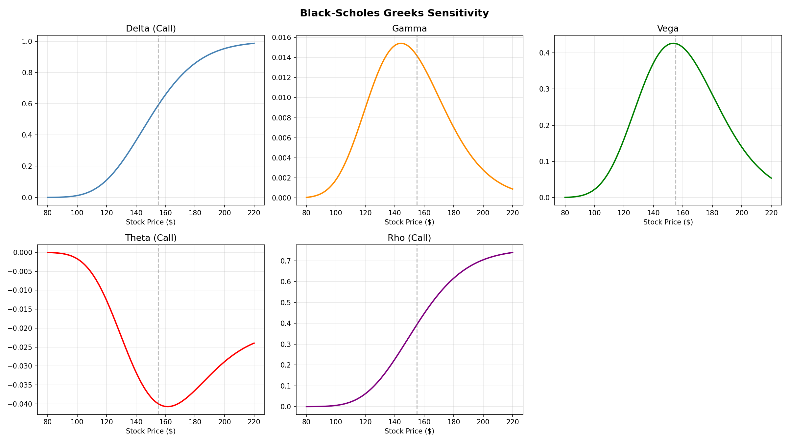

# Black-Scholes Option Pricing Model

A Python implementation of the **Black-Scholes formula** for pricing European call and put options, computing all 5 Greeks, and estimating option prices using live market data.

---

## Formula

$$C = S \cdot N(d_1) - K \cdot e^{-rT} \cdot N(d_2)$$
$$P = K \cdot e^{-rT} \cdot N(-d_2) - S \cdot N(-d_1)$$

Where:
- $d_1 = \frac{\ln(S/K) + (r + \sigma^2/2) \cdot T}{\sigma \sqrt{T}}$
- $d_2 = d_1 - \sigma\sqrt{T}$

---

## Features
- Price European call and put options from scratch
- Compute all 5 Greeks: Δ Delta, Γ Gamma, ν Vega, Θ Theta, ρ Rho
- Live option pricing using real stock data via `yfinance`
- Full unit test suite validating Put-Call Parity and Greek bounds

---

## How to Run

```bash
pip install -r requirements.txt
python tests/test_black_scholes.py
python main.py
```
## Optional
jupyter notebook notebooks/analysis.ipynb
run each cell for a interactive demo
---

## Results

### Option Price vs Stock Price


### Greeks Sensitivity


---

## Sample Output (S=150, K=155, T=0.5yr, r=5%, σ=25%)


| Metric       | Value     |
|--------------|-----------|
| Call Price   | $11.74    |
| Put Price    | $13.54    |
| Delta (Call) | 0.4515    |
| Gamma        | 0.0181    |
| Vega         | 0.2952    |
| Theta        | -0.0347   |
| Rho          | 0.2857    |

---

## Project Structure

```
black_scholes_project/
├── src/
│   ├── black_scholes.py
│   └── real_data.py
├── notebooks/
│   └── analysis.ipynb
├── outputs/
│   ├── bs_option_prices.png
│   └── greeks_plot.png
├── tests/
│   └── test_black_scholes.py
├── main.py
├── requirements.txt
└── README.md
```
